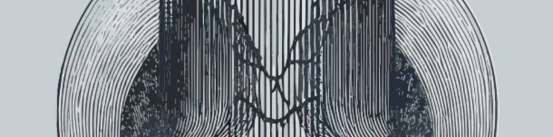

  

<!-- You can replace the banner above with your own — for example, one that combines brains, circuits, and AI imagery -->

<h1 align="center">🧠 Dr. Adrián Alemán-Zapata 🧬</h1>
<h3 align="center">Neuroscientist | Engineer | Developer </h3>

  
  
  
  

---

### 👋 About Me  

Hi there! I’m **Dr. Adrián Alemán-Zapata**, a **Neuroscientist and Engineer** passionate about **sleep, memory, and neurotechnology**.  
My work bridges **brain science and AI**, from **rodent electrophysiology and behavioral tracking** to **AI systems for health and cognitive monitoring**.

💡 *“My goal is to make cutting-edge neuroscience accessible through technology.”*  

- 🌎 Based in **Toronto,Canada**  
- 💤 Researching **how sleep consolidates memory** through neural oscillations  
- ⚙️ Developing **AI tools for animal behavior, health, and neurotech**  
- 🎯 Interests: Sleep • Memory • Closed-Loop Stimulation • Machine Learning • NeuroAI  
- ✨ Fun fact: I love turning brain data into insightful plots  

---

### 🧠 Research & Open Source  

These repositories reflect my journey in **systems neuroscience and computational neurophysiology**, developed during my PhD at the **Donders Institute** (Radboud University, Netherlands).  

- 🧩 [**RGS14**](https://github.com/genzellab/RGS14): Cortical plasticity and memory consolidation  
- 🌿 [**CBD**](https://github.com/genzellab/CBD): Cannabidiol’s effects on sleep and memory  
- ⚡ [**Fast and Slow HFOs**](https://github.com/genzellab/Fast_and_slow_hfos): Hippocampal–prefrontal oscillatory coupling  
- 🐀 [**HM_RAT (Hexmaze Rat Project)**](https://github.com/genzellab/HM_RAT): Multi-camera tracking, LFP event detection & GPU-accelerated spike sorting  

---

### 🧭 Tech Stack  

  
  
  
  
  
  
  
  
  
  

<!--
---

### 📊 GitHub Stats  

  
  
  

---

### 🎧 Recently Played  

  

-->

---

### ☕ Let’s Connect  

  
  
  

---

### 🏆 Achievements  

- 🧠 **PhD cum laude** – Donders Institute, Radboud University  
- 🥇 **DMN Prize 2025 – Best Neuroscience Thesis in the Netherlands**  
  *Awarded by the Dutch Neuroscience Meeting for best PhD thesis.*  
- 🚀 **Best Overall Award – MIT Media Lab MoodEng AI Challenge (2025)**  
  *For leading MonkeyEye, an AI system for primate health and behavior monitoring.*  
- 🤖 **Huawei AI1000 Fellowship (2024)**  
  *Selected among the top 100 globally for advanced AI training in China.*  
---

  

